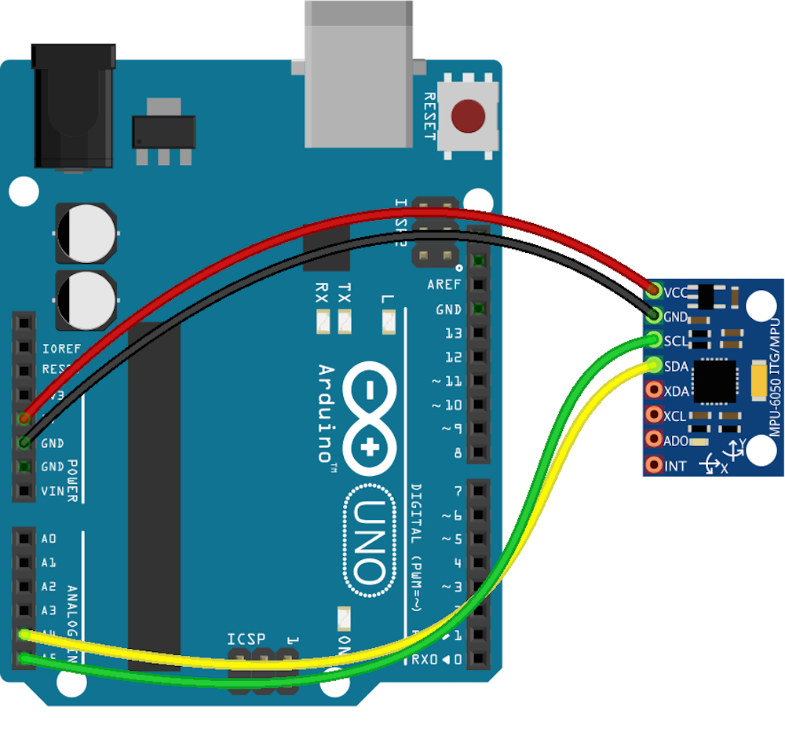
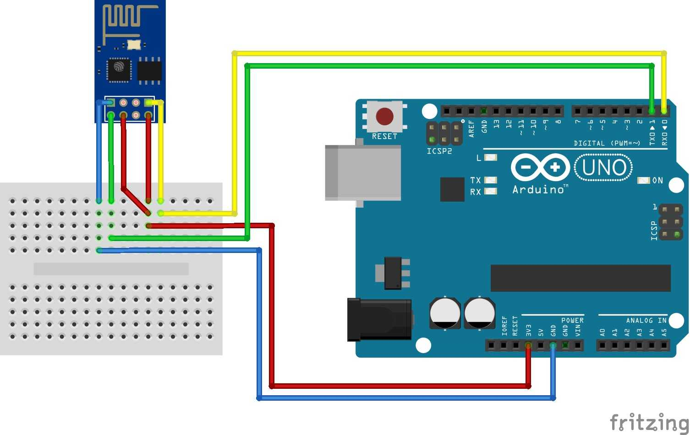

# Internet of Things (IoT) Project – Arduino Backpack Alarm
I always met such situation like while studying in the library or sitting down in a public area with my backpack. I wanted to leave my things away and go to washroom or buy something to drink. But I was always feared someone might steal my backpack.     
After I learned Arduino course, I got an idea to create a backpack alarm. I used the Accelerometer sensor and Arduino board to detect the movement. when there has be movement of more than 10 degrees, it sounds an alarm. And I also use Wifi module to upload sensor data to the Thing Speak web server so that I can monitor the orientation.      
Now, I don't have to worry about bag theft anymore.

## Getting Started

### Hardware components
[Arduino UNO & Genuino UNO](https://www.hackster.io/arduino/products/arduino-uno-genuino-uno?ref=project-ffcd5b)
[MPU6050 Module 3 Axis analog gyro sensors+ 3 Axis Accelerometer Module](https://www.aliexpress.com/item/GY-521-MPU-6050-MPU6050-Module-3-Axis-analog-gyro-sensors-3-Axis-Accelerometer-Module/32340949017.html?src=google&albslr=205957859&src=google&albch=shopping&acnt=494-037-6276&isdl=y&slnk=&plac=&mtctp=&albbt=Google_7_shopping&aff_platform=google&aff_short_key=UneMJZVf&&albagn=888888&albcp=1706979324&albag=67036768539&trgt=296904914040&crea=en32340949017&netw=g&device=c&gclid=CjwKCAiA2fjjBRAjEiwAuewS_RvYRr3opmlLA9QIgF05UjTTG1fleyZEw-YHtdAFWeOlf_HbOj7K2BoClFQQAvD_BwE&gclsrc=aw.ds)
[ESP8266 serial WIFI wireless module ](https://www.aliexpress.com/item/Free-shipping-50pcs-lot-ESP8266-serial-WIFI-wireless-module-wireless-transceiver/32257568124.html?src=google&albslr=202171568&src=google&albch=shopping&acnt=494-037-6276&isdl=y&slnk=&plac=&mtctp=&albbt=Google_7_shopping&aff_platform=google&aff_short_key=UneMJZVf&&albagn=888888&albcp=1706979324&albag=67036768539&trgt=296904914040&crea=en32257568124&netw=g&device=c&gclid=CjwKCAiA2fjjBRAjEiwAuewS_azsTYScUIxKfPpABTfHGl0ntVvLIbKm6-5gTqRsTRE5yWo85hT2LhoCgpwQAvD_BwE&gclsrc=aw.ds)
Arduino Software

### Step 1: Wire up the Arduino

Connect the gyro-mpu6050 board to the Arduino like so:    
VCC - VCC    
GND - GND        
SDA - SCL      
SCL - SDA     

Connect the ESP8266-WiFi module to the Arduino like so:       
GND ------ GND      
VCC ------ VCC      
RXD ------ TX        
TXD ------ RX       

### Step 2: Install the Libraries

Download the [MPU6050 Library](https://github.com/tockn/MPU6050_tockn) library as zip files.       
Open the Arduino IDE.       
Go to Sketch > Include Library > Add.ZIP Library...

## Test it!
If you did everything correctly, after pressing the reset button on your Arduino, you should be greeted with some beeps, 
